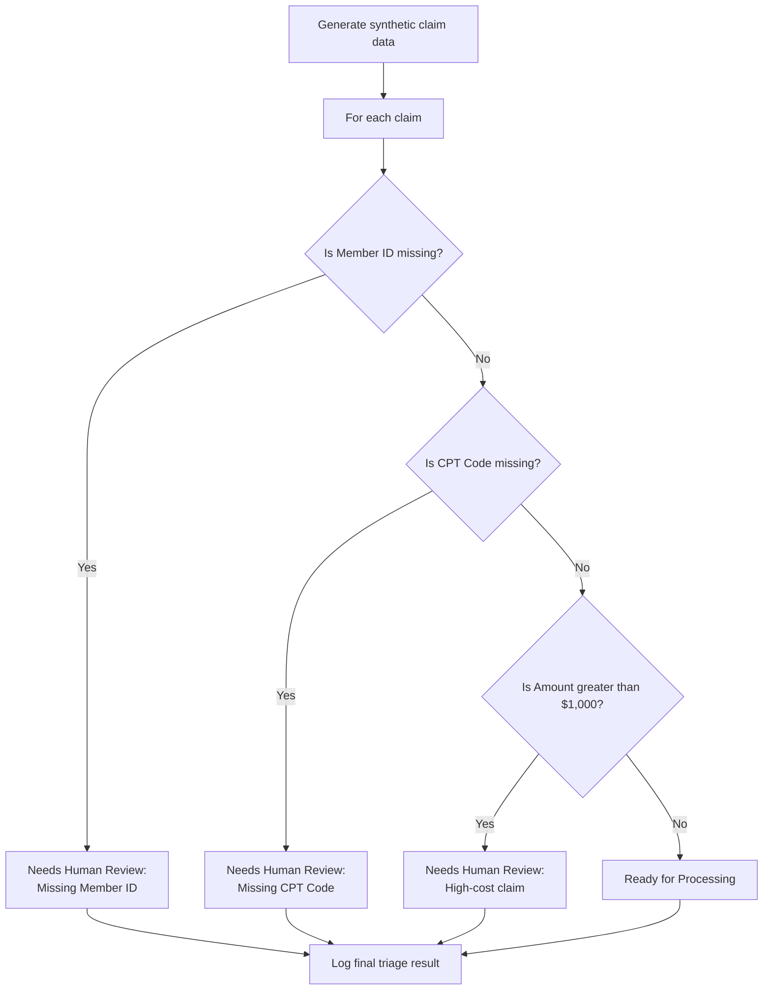
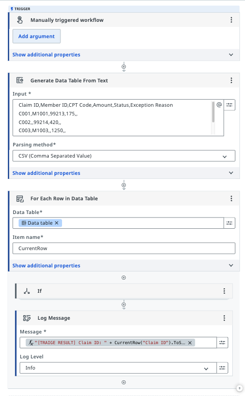
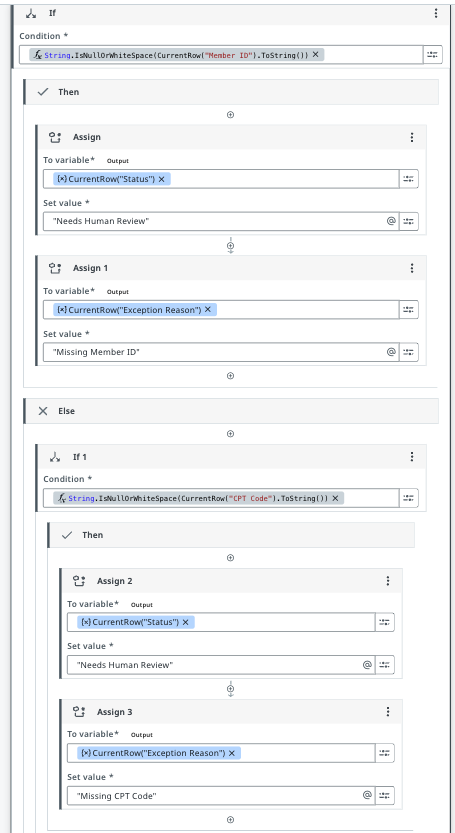
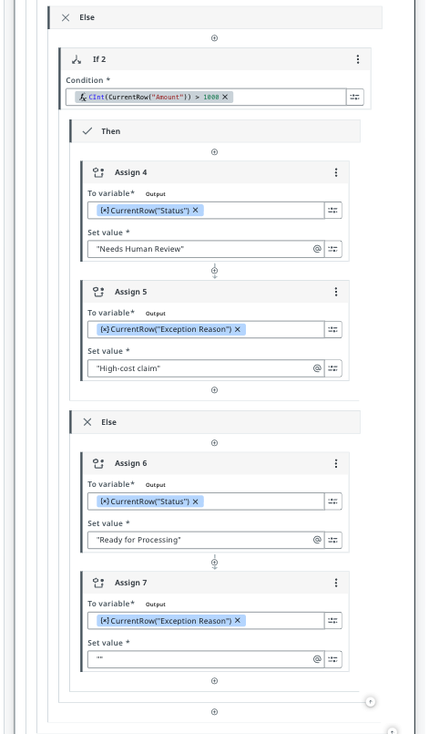
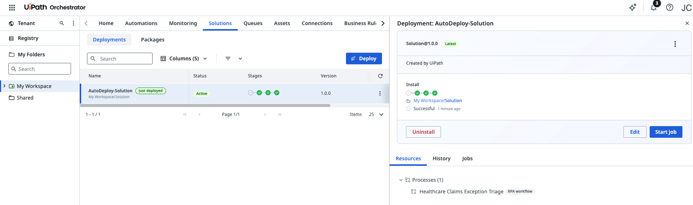
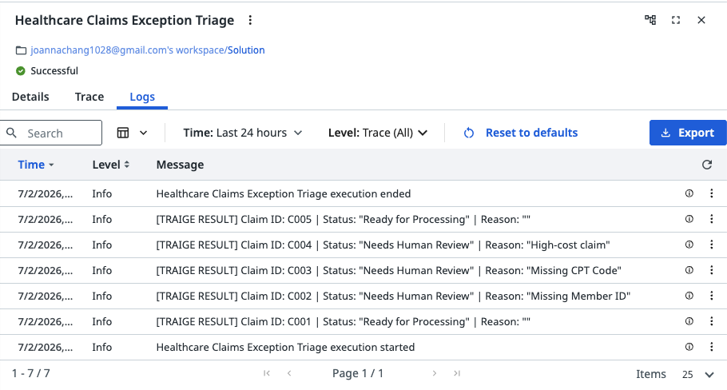

# UiPath Healthcare Claims Triage Automation

A UiPath Studio Web RPA workflow that validates synthetic healthcare claims, assigns processing status, and routes incomplete or high-cost records for human review.

## Project Overview

Healthcare claims processing often requires manual review when claims contain missing information or exceed cost thresholds. This workflow automates the initial validation step, evaluating each claim against defined business rules and assigning it a status:

- **Ready for Processing** — Claim is complete and within cost threshold
- **Needs Human Review** — Claim requires attention due to missing data or high cost

The project demonstrates core RPA capabilities including workflow design, conditional routing, debugging, unattended execution, and deployment through UiPath Orchestrator.

## Workflow Overview

The automation:

1. Loads five synthetic healthcare claims from test data
2. Iterates through each claim record
3. Validates against three business rules
4. Assigns a processing status and review reason
5. Logs results to UiPath execution logs

## Decision Rules

| Condition | Status | Reason |
|---|---|---|
| Member ID is missing | Needs Human Review | Missing Member ID |
| CPT Code is missing | Needs Human Review | Missing CPT Code |
| Claim amount exceeds $1,000 | Needs Human Review | High-cost claim |
| No exceptions detected | Ready for Processing | — |

## Workflow Diagrams

**Main workflow overview:**





**Validation logic (part 1):**



**Validation logic (part 2):**



## Debugging & Troubleshooting

### Initial Issue
The first version used sequential `If` blocks, which caused later conditions to overwrite earlier assignments. For example, a claim flagged as "Needs Human Review" for missing Member ID could be changed back to "Ready for Processing" by a subsequent CPT Code check.

### Solution
I added diagnostic logging to inspect actual values:

```vb
"Claim ID: " + CurrentRow("Claim ID").ToString() +
" | Member ID: [" + CurrentRow("Member ID").ToString() +
"] | Length: " + CurrentRow("Member ID").ToString().Length.ToString()
```

Then restructured the validation logic as nested conditions, ensuring each claim receives exactly one final status without being overwritten.

## Test Results

All five test scenarios passed with expected outputs:

| Claim ID | Test Scenario | Final Status | Reason |
|---|---|---|---|
| C001 | Complete claim | Ready for Processing | — |
| C002 | Missing Member ID | Needs Human Review | Missing Member ID |
| C003 | Missing CPT Code | Needs Human Review | Missing CPT Code |
| C004 | High-cost claim ($2,500) | Needs Human Review | High-cost claim |
| C005 | Complete claim | Ready for Processing | — |

## Deployment & Execution

**Built and deployed using:**
- UiPath Studio Web
- Solution version: 1.0.0
- Deployment method: UiPath Orchestrator
- Execution mode: Unattended RPA
- Performance: ~5.6 seconds per execution

**Deployment screenshots:**





## Repository Structure

```
uipath-healthcare-claims-triage/
├── README.md                              # This file
├── solution/
│   └── Healthcare-Claims-Triage.uis      # UiPath solution package
├── data/
│   └── synthetic-claims.csv              # Test data (5 sample claims)
└── screenshots/
    ├── workflow-overview.png
    ├── validation-logic-part-1.png
    ├── validation-logic-part-2.png
    ├── orchestrator-deployment.png
    └── output-log-message.png
```

## Getting Started

### Prerequisites
- UiPath Automation Cloud account
- UiPath Studio Web access

### Steps to Run

1. Download the `.uis` solution package from the `solution/` folder
2. Sign in to your UiPath Automation Cloud account
3. Open UiPath Studio Web
4. Import the solution package
5. Review the validation rules and test claim data
6. **Test locally:** Run the workflow in Studio Web
7. **Deploy:** Publish to UiPath Orchestrator and execute as an unattended job

> **Note:** UiPath product availability and import options may vary based on your account license and tenant configuration.

## Skills Demonstrated

- **UiPath Studio Web** — Workflow design and debugging
- **UiPath Orchestrator** — Deployment and unattended execution
- **RPA Development** — Exception handling, conditional logic, data validation
- **Healthcare Domain** — Claims triage workflows, human-in-the-loop process design
- **Execution Logging** — Diagnostic output and performance monitoring
- **Workflow Optimization** — Debugging nested conditions, avoiding logic overwrites

## Future Enhancements

- Load claims from Google Sheets, CSV, or external claims API
- Write validated results to structured output files (Excel, JSON)
- Integrate with UiPath Orchestrator Queues for claim processing
- Implement retry logic and advanced exception handling
- Create a human-review queue and approval workflow
- Add configurable validation thresholds
- Track KPIs: processing volume, exception rate, processing time per claim

## Data & Privacy

⚠️ **This project uses synthetic test data only.** It contains:
- No real patient information
- No protected health information (PHI)
- No production credentials or sensitive data

All claims are fictional for demonstration purposes.

## License

This project is provided as-is for educational and portfolio demonstration purposes.
